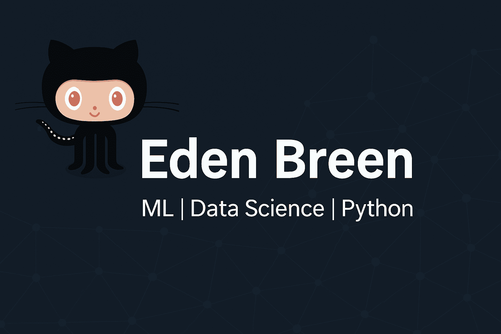

<h1 align="center">Hi there 👋, I'm Eden Breen</h1>

🚀 MSc & BSc in Industrial Engineering & Data Science | Passionate about ML & Insights

  

---

### 💼 About Me

I'm a data enthusiast with a strong foundation in machine learning, data analysis, and statistics.  
I love transforming complex datasets into meaningful insights and building predictive models that make a difference.

🔬 Currently working on my thesis in **Personalized Nutrition using Machine Learning**  
💻 QA at **Yazamtech**, previously a **Data Analyst Intern at Cyvers**  
📈 Applying **unsupervised**, **supervised**, and **deep learning** techniques in academic and personal projects.

---

### 🛠️ Tech Stack

**Languages:**  
 
 

**Libraries & Frameworks:**  
 
 
  
 

**Tools:**  
  
  

---

### 🧪 Featured Projects

#### 🔍 [Crime Data Analysis]([https://github.com/Edenshmuel/Crime-Data-Analysis](https://github.com/Edenshmuel/CrimeData.git))
- Applied **five supervised** and **two unsupervised** machine learning models to predict and analyze crime types.
- Discovered patterns and anomalies in a large dataset of over 2 million records.

#### 🧠 [ICU Nutrition ML](https://github.com/Edenshmuel/ICU_Nutrition_ML.git)
- Developed models to support **personalized nutritional treatment** in ICU patients.
- Combines clustering, supervised learning, and clinical feature engineering.

---

### 📫 Let's Connect

- [📍 LinkedIn](https://www.linkedin.com/in/eden-shmuel-2578b724a/)
- 📧 Email: edenbreen1@gmail.com

---

_“Driven by curiosity, powered by data.”_

